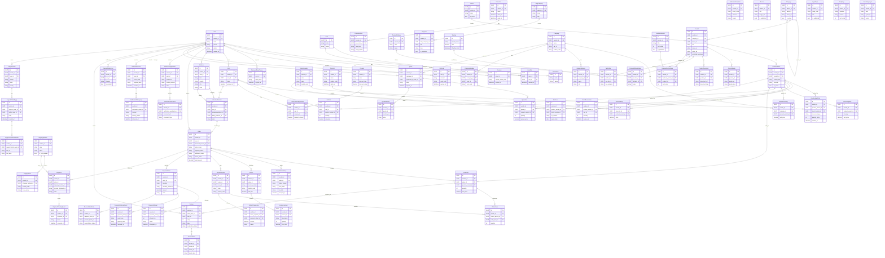

**ERD Version**: 1.0.0 | **Date**: 2026-04-19 | **Status**: Ratified

```mermaid
erDiagram
  %% Identity & Access
  User {
    UUID id PK
    UUID vendor_id FK
    string email
    string phone
    string status
    datetime created_at
  }
  Role {
    UUID id PK
    string code
    string name
  }
  Permission {
    UUID id PK
    string code
    string name
  }
  UserRole {
    UUID id PK
    UUID user_id FK
    UUID role_id FK
    datetime created_at
  }
  Session {
    UUID id PK
    UUID user_id FK
    string refresh_token_hash
    datetime expires_at
  }
  OtpCode {
    UUID id PK
    UUID user_id FK
    string channel
    string code_hash
    datetime expires_at
  }
  PasswordResetToken {
    UUID id PK
    UUID user_id FK
    string token_hash
    datetime expires_at
  }

  %% Catalog
  Category {
    UUID id PK
    UUID parent_id FK
    string name_ar
    string name_en
    bool is_active
  }
  Brand {
    UUID id PK
    UUID vendor_id FK
    string name
    bool is_active
  }
  Product {
    UUID id PK
    UUID vendor_id FK
    UUID category_id FK
    UUID brand_id FK
    string sku
    string name_ar
    string name_en
    bool restricted_purchase
  }
  ProductVariant {
    UUID id PK
    UUID vendor_id FK
    UUID product_id FK
    string variant_sku
    string barcode
    bool is_active
  }
  ProductMedia {
    UUID id PK
    UUID vendor_id FK
    UUID product_id FK
    string media_url
    string media_type
  }
  ProductDocument {
    UUID id PK
    UUID vendor_id FK
    UUID product_id FK
    string document_url
    string document_type
  }
  ProductAttribute {
    UUID id PK
    UUID vendor_id FK
    string code
    string name
  }
  ProductAttributeValue {
    UUID id PK
    UUID vendor_id FK
    UUID product_id FK
    UUID attribute_id FK
    string value
  }

  %% Inventory
  StockLocation {
    UUID id PK
    UUID vendor_id FK
    string code
    string name
    string market_code
  }
  StockLedgerEntry {
    UUID id PK
    UUID vendor_id FK
    UUID product_variant_id FK
    UUID stock_location_id FK
    string movement_type
    int quantity_delta
    datetime created_at
  }
  StockReservation {
    UUID id PK
    UUID vendor_id FK
    UUID product_variant_id FK
    UUID cart_id FK
    int quantity
    datetime expires_at
  }
  BatchLot {
    UUID id PK
    UUID vendor_id FK
    UUID product_variant_id FK
    UUID stock_location_id FK
    string lot_number
    date expiry_date
  }

  %% Pricing & Tax
  PriceList {
    UUID id PK
    UUID vendor_id FK
    string name
    string market_code
    datetime starts_at
  }
  PriceListEntry {
    UUID id PK
    UUID vendor_id FK
    UUID price_list_id FK
    UUID product_variant_id FK
    decimal price
  }
  TierPricingRule {
    UUID id PK
    UUID vendor_id FK
    UUID product_variant_id FK
    int min_qty
    decimal unit_price
  }
  BusinessPricing {
    UUID id PK
    UUID vendor_id FK
    UUID company_id FK
    UUID product_variant_id FK
    decimal unit_price
  }
  Coupon {
    UUID id PK
    UUID vendor_id FK
    string code
    string discount_type
    decimal discount_value
  }
  Promotion {
    UUID id PK
    UUID vendor_id FK
    string name
    datetime starts_at
    datetime ends_at
  }
  PromotionRule {
    UUID id PK
    UUID vendor_id FK
    UUID promotion_id FK
    string rule_type
    string rule_payload
  }
  TaxRate {
    UUID id PK
    string market_code
    decimal rate
    datetime effective_from
  }
  TaxProfile {
    UUID id PK
    UUID vendor_id FK
    UUID product_id FK
    UUID tax_rate_id FK
    string tax_category
  }

  %% Cart & Checkout
  Cart {
    UUID id PK
    UUID vendor_id FK
    UUID user_id FK
    string state
    datetime updated_at
  }
  CartItem {
    UUID id PK
    UUID vendor_id FK
    UUID cart_id FK
    UUID product_variant_id FK
    int quantity
    decimal unit_price
  }
  CartCouponApplication {
    UUID id PK
    UUID vendor_id FK
    UUID cart_id FK
    UUID coupon_id FK
    decimal discount_amount
  }
  CheckoutSession {
    UUID id PK
    UUID vendor_id FK
    UUID cart_id FK
    UUID shipping_address_id FK
    UUID billing_address_id FK
    string state
  }
  Address {
    UUID id PK
    UUID vendor_id FK
    UUID user_id FK
    string kind
    string country
    string city
    string line1
  }

  %% Orders & Fulfillment
  Order {
    UUID id PK
    UUID vendor_id FK
    UUID user_id FK
    UUID checkout_session_id FK
    string order_status
    string payment_status
    string fulfillment_status
    string return_status
    decimal total_amount
  }
  OrderItem {
    UUID id PK
    UUID vendor_id FK
    UUID order_id FK
    UUID product_variant_id FK
    int quantity
    decimal unit_price
  }
  OrderStatusHistory {
    UUID id PK
    UUID vendor_id FK
    UUID order_id FK
    string status_stream
    string from_state
    string to_state
    datetime changed_at
  }
  Invoice {
    UUID id PK
    UUID vendor_id FK
    UUID order_id FK
    string invoice_number
    string market_code
    decimal total_tax
  }
  InvoiceLineItem {
    UUID id PK
    UUID vendor_id FK
    UUID invoice_id FK
    string description
    int quantity
    decimal line_total
  }

  %% Returns & Refunds
  ReturnRequest {
    UUID id PK
    UUID vendor_id FK
    UUID order_id FK
    UUID user_id FK
    string state
    string reason_code
  }
  ReturnItem {
    UUID id PK
    UUID vendor_id FK
    UUID return_request_id FK
    UUID order_item_id FK
    int quantity
  }
  RefundTransaction {
    UUID id PK
    UUID vendor_id FK
    UUID return_request_id FK
    UUID payment_intent_id FK
    decimal amount
    string status
  }

  %% Verification
  VerificationApplication {
    UUID id PK
    UUID vendor_id FK
    UUID user_id FK
    string profession
    string license_number
    string state
  }
  VerificationDocument {
    UUID id PK
    UUID vendor_id FK
    UUID verification_application_id FK
    string document_url
    string document_type
  }

  %% Quotes & B2B
  Company {
    UUID id PK
    UUID vendor_id FK
    string name
    string vat_id
    string market_code
  }
  CompanyBranch {
    UUID id PK
    UUID vendor_id FK
    UUID company_id FK
    string name
    string city
  }
  CompanyMember {
    UUID id PK
    UUID vendor_id FK
    UUID company_id FK
    UUID user_id FK
    string role_code
  }
  Quote {
    UUID id PK
    UUID vendor_id FK
    UUID company_id FK
    UUID requested_by_user_id FK
    string state
    datetime expires_at
  }
  QuoteItem {
    UUID id PK
    UUID vendor_id FK
    UUID quote_id FK
    UUID product_variant_id FK
    int quantity
    decimal quoted_price
  }
  QuoteRevision {
    UUID id PK
    UUID vendor_id FK
    UUID quote_id FK
    int revision_no
    string note
  }

  %% Payments
  PaymentIntent {
    UUID id PK
    UUID vendor_id FK
    UUID order_id FK
    string provider
    string provider_reference
    decimal amount
    string state
  }
  PaymentAttempt {
    UUID id PK
    UUID vendor_id FK
    UUID payment_intent_id FK
    int attempt_no
    string result
    datetime attempted_at
  }
  PaymentWebhookEvent {
    UUID id PK
    UUID vendor_id FK
    UUID payment_intent_id FK
    string event_type
    string payload_hash
    datetime received_at
  }
  ReconciliationEntry {
    UUID id PK
    UUID vendor_id FK
    UUID payment_intent_id FK
    string provider_batch_id
    string reconciliation_status
  }

  %% Shipping
  ShippingMethod {
    UUID id PK
    UUID vendor_id FK
    string code
    string name
    bool is_cod_enabled
  }
  ShippingZone {
    UUID id PK
    UUID vendor_id FK
    UUID shipping_method_id FK
    string market_code
    string zone_name
  }
  Shipment {
    UUID id PK
    UUID vendor_id FK
    UUID order_id FK
    UUID shipping_method_id FK
    string provider_shipment_id
    string state
  }
  ShipmentTrackingEvent {
    UUID id PK
    UUID vendor_id FK
    UUID shipment_id FK
    string status
    datetime occurred_at
  }

  %% Notifications
  NotificationTemplate {
    UUID id PK
    UUID vendor_id FK
    string event_code
    string channel
    string locale
  }
  NotificationEvent {
    UUID id PK
    UUID vendor_id FK
    UUID user_id FK
    string event_code
    string payload_hash
    datetime created_at
  }
  NotificationDeliveryLog {
    UUID id PK
    UUID vendor_id FK
    UUID notification_event_id FK
    string channel
    string delivery_status
    datetime delivered_at
  }
  ChannelPreference {
    UUID id PK
    UUID vendor_id FK
    UUID user_id FK
    string channel
    bool is_enabled
  }

  %% CMS
  Banner {
    UUID id PK
    UUID vendor_id FK
    string title
    string image_url
    bool is_published
  }
  FeaturedSection {
    UUID id PK
    UUID vendor_id FK
    string title
    int sort_order
    bool is_published
  }
  FeaturedSectionItem {
    UUID id PK
    UUID vendor_id FK
    UUID featured_section_id FK
    UUID product_id FK
    int sort_order
  }
  BlogPost {
    UUID id PK
    UUID vendor_id FK
    UUID blog_category_id FK
    string title
    string slug
    bool is_published
  }
  BlogCategory {
    UUID id PK
    UUID vendor_id FK
    string name
    string slug
  }
  LegalPage {
    UUID id PK
    UUID vendor_id FK
    string page_code
    string title
    bool is_published
  }
  FaqEntry {
    UUID id PK
    UUID vendor_id FK
    string question
    string answer
    int sort_order
  }

  %% Reviews
  Review {
    UUID id PK
    UUID vendor_id FK
    UUID order_item_id FK
    UUID user_id FK
    int rating
    string body
    string moderation_status
  }
  ReviewMedia {
    UUID id PK
    UUID vendor_id FK
    UUID review_id FK
    string media_url
    string media_type
  }

  %% Support
  SupportTicket {
    UUID id PK
    UUID vendor_id FK
    UUID user_id FK
    string subject
    string state
    string priority
  }
  SupportTicketReply {
    UUID id PK
    UUID vendor_id FK
    UUID support_ticket_id FK
    UUID author_user_id FK
    string body
    datetime created_at
  }
  SupportTicketAttachment {
    UUID id PK
    UUID vendor_id FK
    UUID support_ticket_reply_id FK
    string file_url
    string file_name
  }

  %% Search
  SearchSynonym {
    UUID id PK
    UUID vendor_id FK
    string term
    string synonym
    string locale
  }

  %% Relationships
  User ||--o{ UserRole : has
  Role ||--o{ UserRole : assigned
  Role ||--o{ Permission : grants
  User ||--o{ Session : owns
  User ||--o{ OtpCode : receives
  User ||--o{ PasswordResetToken : requests

  Category ||--o{ Category : parent_of
  Category ||--o{ Product : classifies
  Brand ||--o{ Product : brands
  Product ||--o{ ProductVariant : has
  Product ||--o{ ProductMedia : has
  Product ||--o{ ProductDocument : has
  Product ||--o{ ProductAttributeValue : has
  ProductAttribute ||--o{ ProductAttributeValue : defines

  ProductVariant ||--o{ StockLedgerEntry : tracked_by
  StockLocation ||--o{ StockLedgerEntry : records
  ProductVariant ||--o{ StockReservation : reserved_in
  Cart ||--o{ StockReservation : creates
  ProductVariant ||--o{ BatchLot : batched_in
  StockLocation ||--o{ BatchLot : stores

  PriceList ||--o{ PriceListEntry : contains
  ProductVariant ||--o{ PriceListEntry : priced_in
  ProductVariant ||--o{ TierPricingRule : tiered_by
  Company ||--o{ BusinessPricing : has
  ProductVariant ||--o{ BusinessPricing : applies_to
  Promotion ||--o{ PromotionRule : has
  TaxRate ||--o{ TaxProfile : applied_by
  Product ||--o{ TaxProfile : taxed_by

  User ||--o{ Cart : owns
  Cart ||--o{ CartItem : contains
  ProductVariant ||--o{ CartItem : selected_as
  Cart ||--o{ CartCouponApplication : has
  Coupon ||--o{ CartCouponApplication : applied
  User ||--o{ Address : owns
  Cart ||--|| CheckoutSession : creates
  Address ||--o{ CheckoutSession : shipping
  Address ||--o{ CheckoutSession : billing

  User ||--o{ Order : places
  CheckoutSession ||--o{ Order : converted_to
  Order ||--o{ OrderItem : contains
  ProductVariant ||--o{ OrderItem : sold_as
  Order ||--o{ OrderStatusHistory : tracks
  Order ||--o{ Invoice : billed_by
  Invoice ||--o{ InvoiceLineItem : contains

  Order ||--o{ ReturnRequest : has
  ReturnRequest ||--o{ ReturnItem : contains
  OrderItem ||--o{ ReturnItem : references
  ReturnRequest ||--o{ RefundTransaction : initiates

  User ||--o{ VerificationApplication : submits
  VerificationApplication ||--o{ VerificationDocument : includes

  Company ||--o{ CompanyBranch : has
  Company ||--o{ CompanyMember : has
  User ||--o{ CompanyMember : belongs
  Company ||--o{ Quote : requests
  User ||--o{ Quote : submits
  Quote ||--o{ QuoteItem : contains
  ProductVariant ||--o{ QuoteItem : quoted_as
  Quote ||--o{ QuoteRevision : revises

  Order ||--o{ PaymentIntent : paid_by
  PaymentIntent ||--o{ PaymentAttempt : attempts
  PaymentIntent ||--o{ PaymentWebhookEvent : emits
  PaymentIntent ||--o{ ReconciliationEntry : reconciled_by

  ShippingMethod ||--o{ ShippingZone : defines
  Order ||--o{ Shipment : fulfilled_by
  ShippingMethod ||--o{ Shipment : ships_with
  Shipment ||--o{ ShipmentTrackingEvent : tracks

  User ||--o{ NotificationEvent : receives
  NotificationEvent ||--o{ NotificationDeliveryLog : logs
  User ||--o{ ChannelPreference : configures

  FeaturedSection ||--o{ FeaturedSectionItem : contains
  Product ||--o{ FeaturedSectionItem : featured_as
  BlogCategory ||--o{ BlogPost : groups

  OrderItem ||--o{ Review : reviewed_as
  User ||--o{ Review : writes
  Review ||--o{ ReviewMedia : has

  User ||--o{ SupportTicket : opens
  SupportTicket ||--o{ SupportTicketReply : has
  SupportTicketReply ||--o{ SupportTicketAttachment : has
```
