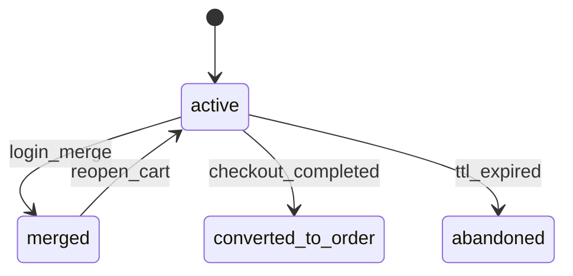

**Domain**: cart | **Version**: 1.0.0 | **Date**: 2026-04-19

| From State | To State | Trigger | Authorized Actor | Failure Behavior | Timeout Behavior |
|---|---|---|---|---|---|
| active | merged | login_merge | System | remain `active` and keep guest cart intact | N/A |
| active | converted_to_order | checkout_completed | Customer, Professional, B2B Buyer | remain `active` and rollback checkout session | N/A |
| active | abandoned | ttl_expired | System | remain `active` if cleanup fails | retry cleanup job every hour |
| merged | active | reopen_cart | Customer, Professional, B2B Buyer | remain `merged` | N/A |
