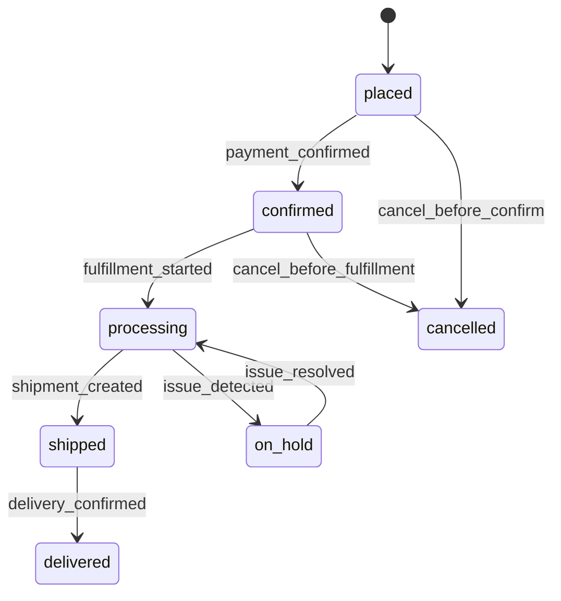

**Domain**: order | **Version**: 1.0.0 | **Date**: 2026-04-19

| From State | To State | Trigger | Authorized Actor | Failure Behavior | Timeout Behavior |
|---|---|---|---|---|---|
| placed | confirmed | payment_confirmed | System | remain `placed` | alert operations if not confirmed within SLA |
| confirmed | processing | fulfillment_started | Admin Write, Admin Super, System | remain `confirmed` | auto-escalate for warehouse intervention |
| processing | shipped | shipment_created | Admin Write, Admin Super, System | remain `processing` | retry shipment creation via adapter queue |
| shipped | delivered | delivery_confirmed | System | remain `shipped` | poll carrier updates until terminal state |
| placed | cancelled | cancel_before_confirm | Customer, Professional, B2B Buyer, Admin Write, Admin Super | remain `placed` | N/A |
| confirmed | cancelled | cancel_before_fulfillment | Admin Write, Admin Super | remain `confirmed` | N/A |
| processing | on_hold | issue_detected | Admin Write, Admin Super, System | remain `processing` | N/A |
| on_hold | processing | issue_resolved | Admin Write, Admin Super | remain `on_hold` | auto-escalate if hold exceeds SLA |
