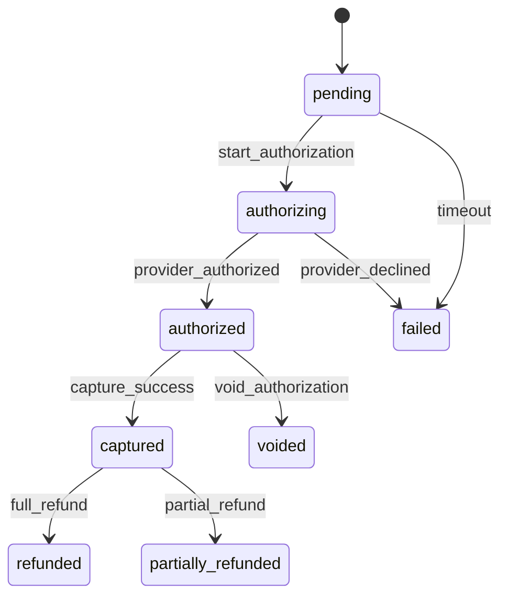

**Domain**: payment | **Version**: 1.0.0 | **Date**: 2026-04-19

| From State | To State | Trigger | Authorized Actor | Failure Behavior | Timeout Behavior |
|---|---|---|---|---|---|
| pending | authorizing | start_authorization | System | remain `pending` | auto-transition to `failed` after payment-init timeout |
| authorizing | authorized | provider_authorized | System | remain `authorizing` and retry webhook reconciliation | auto-transition to `failed` after provider SLA |
| authorizing | failed | provider_declined | System | remain `authorizing` if callback parse fails | retry callback processing |
| authorized | captured | capture_success | System | remain `authorized` | retry capture until max-attempt reached, then `failed` |
| authorized | voided | void_authorization | Admin Write, Admin Super, System | remain `authorized` | auto-void after authorization expiry window |
| captured | refunded | full_refund | Admin Write, Admin Super, System | remain `captured` and log error | retry refund dispatch with backoff |
| captured | partially_refunded | partial_refund | Admin Write, Admin Super, System | remain `captured` | N/A |
| pending | failed | timeout | System | remain `pending` if transition write fails | retry timeout transition job |
