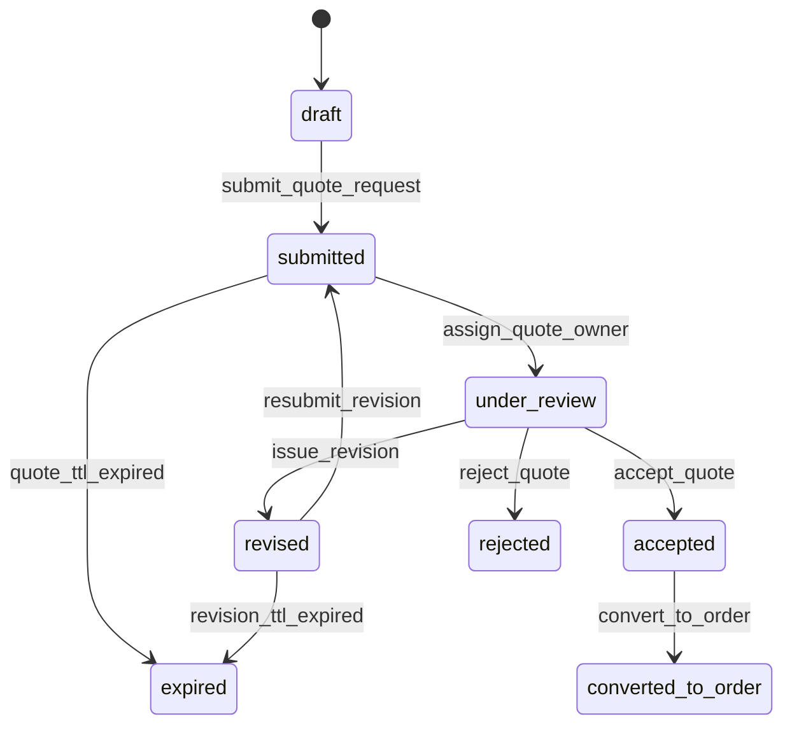

**Domain**: quote | **Version**: 1.0.0 | **Date**: 2026-04-19

| From State | To State | Trigger | Authorized Actor | Failure Behavior | Timeout Behavior |
|---|---|---|---|---|---|
| draft | submitted | submit_quote_request | B2B Buyer, B2B Approver, B2B Branch Admin, B2B Company Owner | remain `draft` | N/A |
| submitted | under_review | assign_quote_owner | Admin Write, Admin Super | remain `submitted` | auto-escalate unassigned quotes |
| under_review | revised | issue_revision | Admin Write, Admin Super | remain `under_review` | N/A |
| revised | submitted | resubmit_revision | B2B Buyer, B2B Approver, B2B Branch Admin, B2B Company Owner | remain `revised` | auto-expire revision after SLA |
| under_review | accepted | accept_quote | B2B Approver, B2B Company Owner, Admin Write, Admin Super | remain `under_review` | N/A |
| under_review | rejected | reject_quote | Admin Write, Admin Super, B2B Approver, B2B Company Owner | remain `under_review` | N/A |
| accepted | converted_to_order | convert_to_order | System, Admin Write, Admin Super | remain `accepted` | retry conversion queue |
| submitted | expired | quote_ttl_expired | System | remain `submitted` | retry expiry job |
| revised | expired | revision_ttl_expired | System | remain `revised` | retry expiry job |
