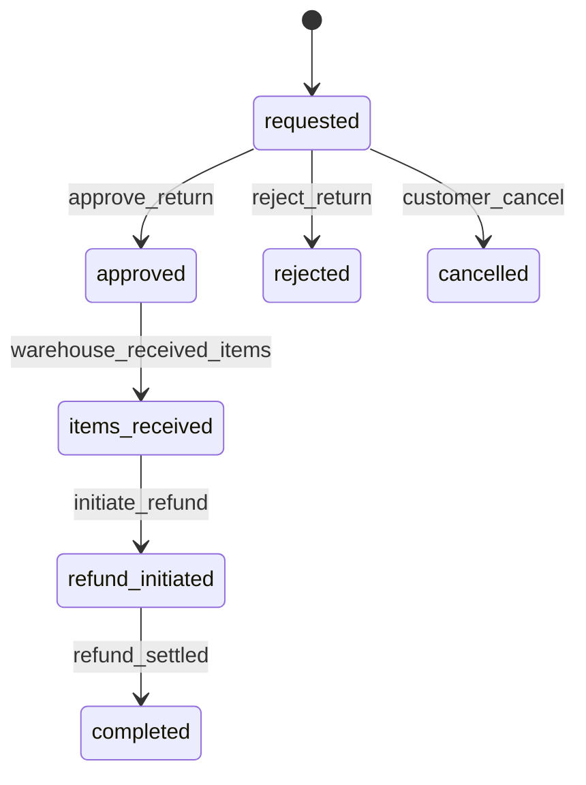

**Domain**: return | **Version**: 1.0.0 | **Date**: 2026-04-19

| From State | To State | Trigger | Authorized Actor | Failure Behavior | Timeout Behavior |
|---|---|---|---|---|---|
| requested | approved | approve_return | Admin Write, Admin Super | remain `requested` | auto-escalate pending queue |
| requested | rejected | reject_return | Admin Write, Admin Super | remain `requested` | auto-escalate pending queue |
| approved | items_received | warehouse_received_items | Admin Write, Admin Super, System | remain `approved` | reminder job to warehouse |
| items_received | refund_initiated | initiate_refund | System, Admin Write, Admin Super | remain `items_received` | retry refund-initiation adapter |
| refund_initiated | completed | refund_settled | System | remain `refund_initiated` | reconcile with payment provider until terminal |
| requested | cancelled | customer_cancel | Customer, Professional, B2B Buyer | remain `requested` | N/A |
