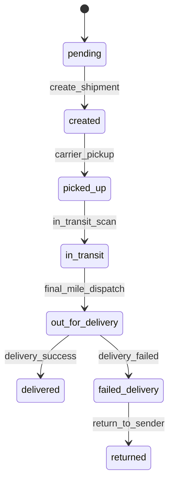

**Domain**: shipment | **Version**: 1.0.0 | **Date**: 2026-04-19

| From State | To State | Trigger | Authorized Actor | Failure Behavior | Timeout Behavior |
|---|---|---|---|---|---|
| pending | created | create_shipment | System | remain `pending` | retry create API with backoff |
| created | picked_up | carrier_pickup | System | remain `created` | auto-escalate to carrier support |
| picked_up | in_transit | in_transit_scan | System | remain `picked_up` | continue polling carrier events |
| in_transit | out_for_delivery | final_mile_dispatch | System | remain `in_transit` | continue polling carrier events |
| out_for_delivery | delivered | delivery_success | System | remain `out_for_delivery` | reconcile with proof-of-delivery job |
| out_for_delivery | failed_delivery | delivery_failed | System | remain `out_for_delivery` | auto-create retry delivery task |
| failed_delivery | returned | return_to_sender | System | remain `failed_delivery` | retry return initiation until accepted |
