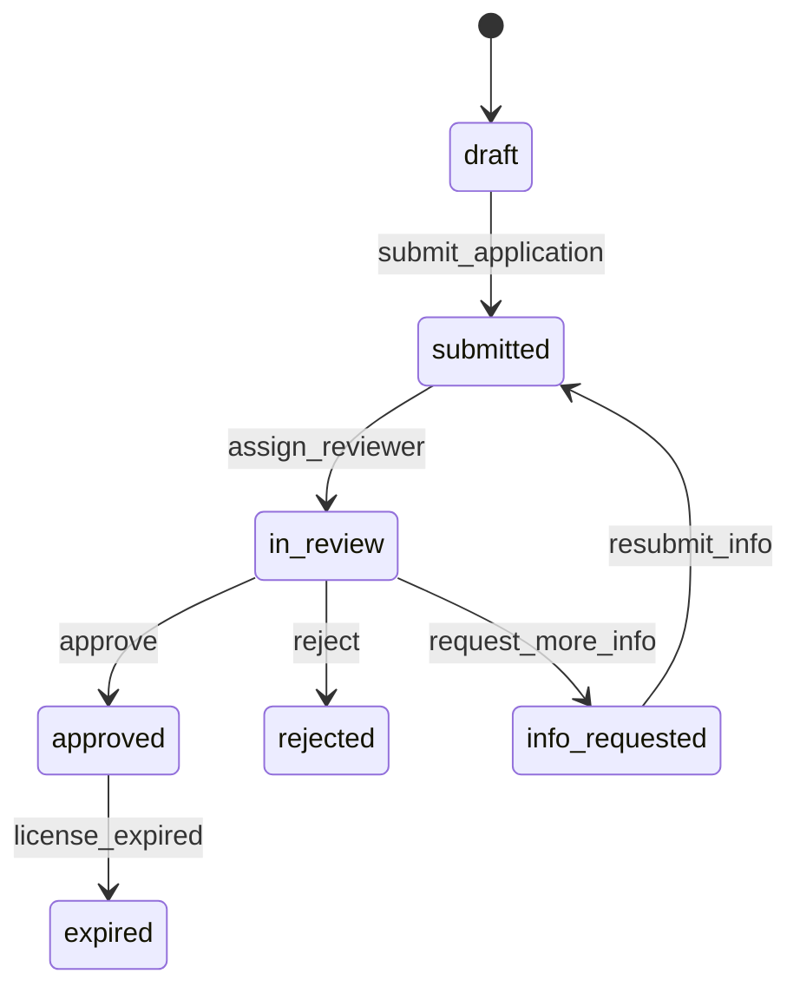

**Domain**: verification | **Version**: 1.0.0 | **Date**: 2026-04-19

| From State | To State | Trigger | Authorized Actor | Failure Behavior | Timeout Behavior |
|---|---|---|---|---|---|
| draft | submitted | submit_application | Customer, Professional | remain `draft` and show validation errors | N/A |
| submitted | in_review | assign_reviewer | Admin Write, Admin Super | remain `submitted` | auto-escalate to Admin Super after SLA |
| in_review | approved | approve | Admin Write, Admin Super | remain `in_review` | N/A |
| in_review | rejected | reject | Admin Write, Admin Super | remain `in_review` | N/A |
| in_review | info_requested | request_more_info | Admin Write, Admin Super | remain `in_review` | N/A |
| info_requested | submitted | resubmit_info | Customer, Professional | remain `info_requested` | auto-mark `rejected` after response SLA |
| approved | expired | license_expired | System | remain `approved` if expiry job fails | retry daily until transition succeeds |
